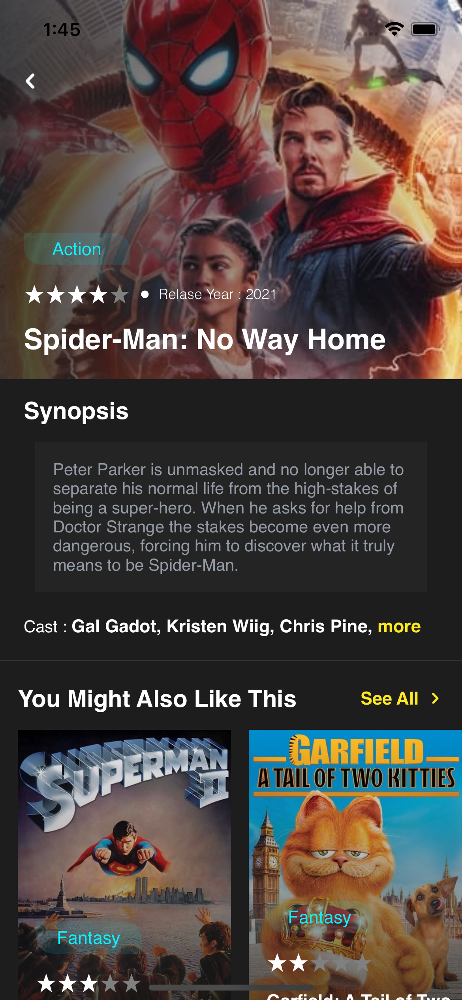
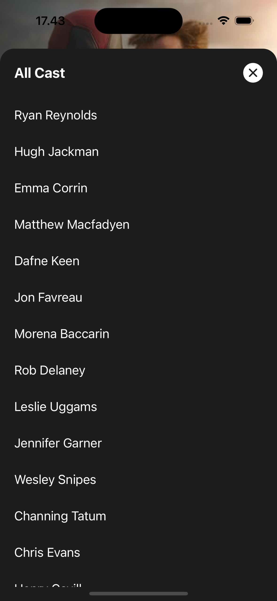
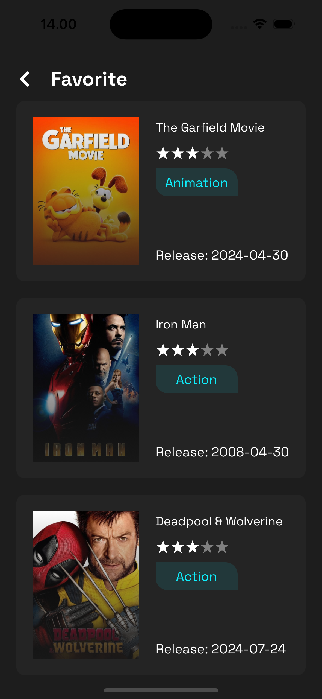
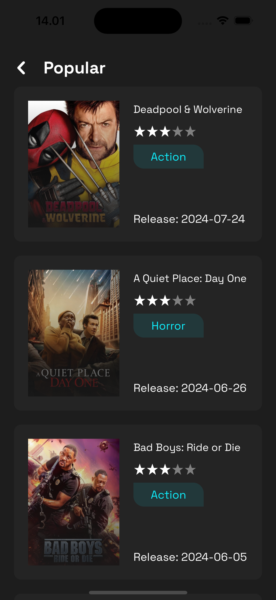
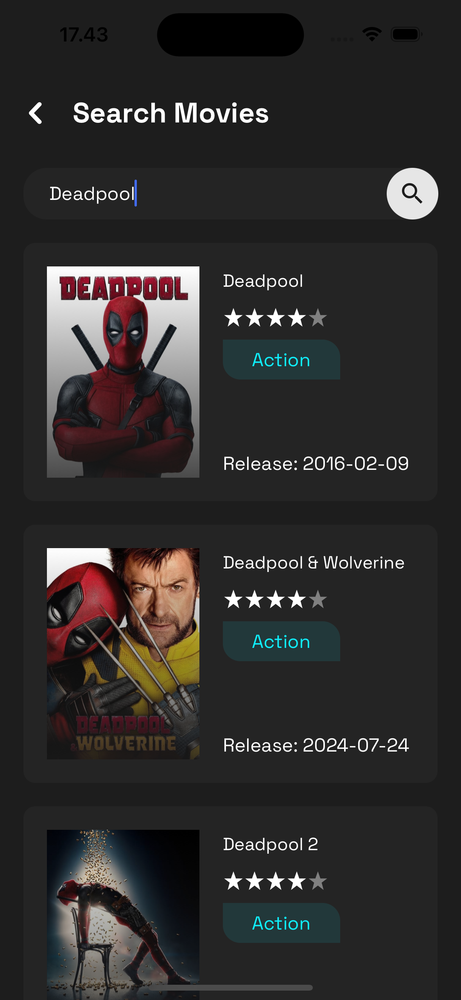

# Movie App 
Movie App is a mobile application that displays a list of popular movies, top-rated movies, detailed movie information, favorite movie, including cast details, genres in list. This app uses Expo - React Native and several additional libraries for animation and data management.

## Preview
[](main.png)
[](detail.png)
[](modal_cast.png)
[](favorite.png)
[](movie_movies.png)
[](search_movies.png)


### Currently includes:
- [Demo Android App](https://drive.google.com/file/d/1WH8XuoNEVQUAV8rCO-DRWkqAarlQPmh_/view?usp=sharing)
- Expo CLI
- React Native
- React Navigation
- MobX State Tree
- TypeScript
- And more!


### Instalasi

1. Clone this repository

```bash
git clone https://github.com/M-Julius/Movie-App.git
```

2. Install dependencies

```bash
cd Movie-App
npm install
```
3. Setup environment in ```app/config/config.dev.ts``` and ```app/config/config.prod.ts```
```javascript
const API_URL = "https://api.themoviedb.org/3"
const API_KEY = "" // add your API_KEY TMDB
const URI_STORAGE = "https://image.tmdb.org/t/p/w500"
```
[Get API_KEY](https://developer.themoviedb.org/reference/intro/getting-started)

4. Run a

```bash
npx expo start
```

5. Select your devices


### Feature App:
- [x] Now Playing Movies
- [x] Popular Movies
- [x] Top Rated Movies
- [x] Detail Movie
- [x] Similar Movies
- [x] List More Movies
- [x] Favorite Movies
- [x] Genres Movies
- [x] Cast Movie